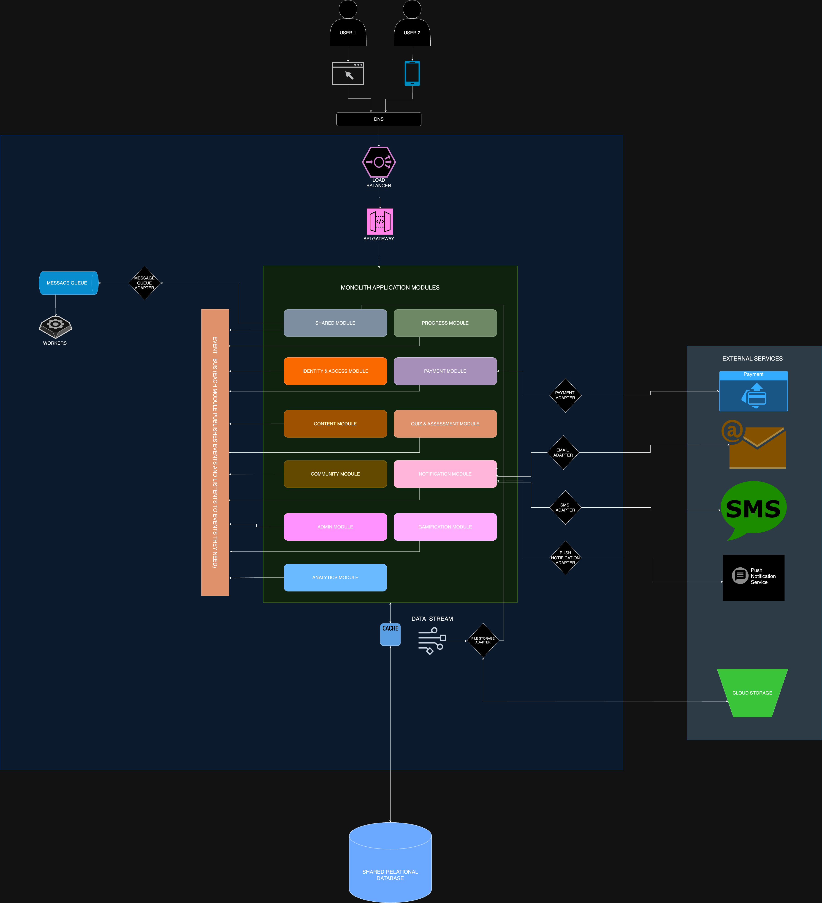

<p align="center">
  <a href="http://nestjs.com/" target="blank"></a>
</p>

<h1 align="center">TypeScript NestJS Clean Architecture</h1>

<div align="center">
  <a href="https://github.com/wesleey/nest-clean-architecture/blob/HEAD/LICENSE" target="blank">
    
  </a>
  <a href="https://www.typescriptlang.org/" target="blank">
    
  </a>
  <a href="https://nestjs.com/" target="blank">
    
  </a>
  <a href="https://nodejs.org/" target="blank">
    
  </a>
  <a href="https://en.wikipedia.org/wiki/Clean_architecture" target="blank">
    
  </a>
</div>

## Description

This project serves as a practical implementation of Clean Architecture principles using TypeScript, with NestJS as the presentation layer. It aims to demonstrate how to build scalable, maintainable, and testable applications in a modular monolith fashion by adhering to the separation of concerns and dependency inversion principles.

### Key Features

-   **Clean Architecture**: Showcases the implementation of Uncle Bob's Clean Architecture in TypeScript.
-   **NestJS Integration**: Utilizes NestJS as the web framework in the presentation layer, demonstrating how it fits into a clean architecture structure.
-   **TypeScript**: Leverages TypeScript's strong typing to enhance code quality and developer experience.
-   **Separation of Concerns**: Clear separation between business logic, application services, and infrastructure.
-   **Dependency Inversion**: Demonstrates how to use interfaces and dependency injection to decouple modules.
-   **Use Case Driven**: Organized around business use cases, making the system's intentions clear and maintainable.
-   **Testability**: Designed with testing in mind, allowing for easy unit testing of business logic without infrastructure concerns.

## Application Architecture

This project implements a Clean Architecture approach using TypeScript and NestJS, structured into three main layers: Core, Infrastructure, and Presentation. This architecture promotes separation of concerns, maintainability, and testability.

<p align="center">
  
</p>

### Project Structure

```bash
typescript-nestjs-clean-architecture
  |-env
  |-logs
  |-src
  |  |-shared
  |  |  |-core
  |  |  |-infrastructure
  |  |  |-presentation
  |  |-modules
  |  |  |-identity-and-access
  |  |  |  |-core
  |  |  |  |  |-domain
  |  |  |  |  |-handlers
  |  |  |  |  |-usecases
  |  |  |  |-infrastructure
  |  |  |  |  |-persistence
  |  |  |  |  |  |-prisma
  |  |  |  |-presentation
  |  |  |  |  |-nest-modules
  |  |  |  |  |-http
  |  |  |-notification
  |  |  |  |-core
  |  |  |  |-infrastructure
  |  |  |  |-presentation
  |-.gitignore
  |-docker-compose.local.yml
  |-tsconfig.json
  |-package.json

```

### Key Directories

-   `docs`: Project documentation directory.
-   `env/`: Environment configuration files.
-   `logs/`: Application logs.
-   `src/`: Source code.
    -   `shared/`: Shared components across modules. Follows a clean architecture structure with core, infrastructure, and presentation layers.
    -   `modules/`: Feature-specific modules.
        -   Each module follows a clean architecture structure with core, infrastructure, and presentation layers
        -   `core/`: Contains the business logic and domain models.
        -   `infrastructure/`: Implements interfaces (ports) defined in the core.
        -   `presentation/`: Houses the NestJS application (Restful http API).

### Layer Descriptions

1. **Core Layer**

    - Houses the business logic and rules of the application.
    - Contains domain entities, value objects, and business logic interfaces (ports).
    - Defines use cases as commands and queries, each with their respective DTOs.
    - Includes event and task handlers for processing domain events and background tasks.

2. **Infrastructure Layer**

    - Implements the interfaces defined in the Core layer.
    - Contains concrete implementations of repositories, caching, logging, task queues, and event buses.
    - Manages interactions with external services like file storage, email, and SMS.
    - Includes mappers for translating between domain entities and data transfer objects.

3. **Presentation Layer**
    - Entry point of the application that calls each use cases.
    - Utilizes NestJS to implement a RESTful API.
    - Utilizes NestJS for dependency injection.
    - Contains controllers that define action methods for handling HTTP requests.
    - Responsible for presenting data to end-users in an easily understandable format.

### Advantages of This Architecture

1. **Separation of Concerns**: Each layer has a distinct responsibility, making the codebase easier to understand and maintain.

2. **Domain-Centric**: The core business logic is isolated from external concerns, which ensures that it remains pure and focused on solving domain problems.

3. **Flexibility**: The use of interfaces (ports) in the Core layer allows for easy swapping of implementations in the Infrastructure layer without affecting business logic.

4. **Testability**: Business logic can be unit tested independently of infrastructure concerns, resulting to more reliable and faster tests.

5. **Scalability**: New features can be added by creating new use cases without modifying existing code, which adheres to the Open-Closed Principle.

6. **Technology Independence**: The Core layer is independent of frameworks and external services, which allows for easier updates or replacements of technologies in other layers.

7. **Clear Dependencies**: Dependencies flow inwards, with the Core layer having no dependencies on outer layers, reducing coupling.

8. **Maintainability**: The clear structure makes it easier for new developers to understand the system and locate specific functionalities.

9. **Modularity**: The architecture supports a modular approach, which allows for easy addition or removal of features.

10. **Adherence to SOLID Principles**: The architecture naturally encourages adherence to SOLID principles, which leads to a more robust and flexible code.

This Clean Architecture approach, combined with TypeScript's strong typing and NestJS's powerful features, like dependency injection, results in a highly maintainable, scalable, and testable application structure.

## Running the Project Locally

Follow these steps to set up and run the project on your local machine:

1. **Set Environment Variables**

    In the `env` folder, set the necessary environment variable values to each environment variable key defined in each `env` file.

2. **Start PostgreSQL and Redis**

    Ensure that PostgreSQL and Redis are running on your local machine. If you're using Docker, you can start them by running the `docker-compose.local.yml` file defined in this project:

    ```bash
    docker-compose -f docker-compose.local.yml up -d
    ```

    Adjust the commands as necessary if you have different configurations.

3. **Install Dependencies**

    Install the required Node.js packages:

    ```bash
    yarn install
    ```

4. **Run Prisma Migrations**

    Apply the database schema using Prisma migrations:

    ```bash
    yarn prisma:migrate:deploy
    ```

5. **Seed the database**

    Apply database seeds by running:

    ```bash
    yarn prisma:seed
    ```

6. **Start the Application**

    Launch the application in local development mode:

    ```bash
    yarn start:local
    ```

    The application should now be running and accessible at http://localhost:3005 (or whichever port you've configured).

    API documentation can be accessed here: http://localhost:3005/api-docs

**Note:** Make sure you have Node.js, Yarn, Docker (if using it for PostgreSQL and Redis), and any other necessary tools installed on your system before starting these steps.

## Available Commands

| Command                      | Action                                                                                   |
| ---------------------------- | ---------------------------------------------------------------------------------------- |
| `yarn build`                 | Builds the NestJS application and outputs it in the dist directory                       |
| `yarn format`                | Formats all TypeScript files in `src` directory using Prettier                           |
| `yarn copy:local-env`        | Copies the local environment file to `.env`                                              |
| `yarn start`                 | Copies the local environment file and starts the application using `ts-node`             |
| `yarn start:local`           | Copies the local environment file and starts the application in watch mode using Nodemon |
| `yarn start:prod`            | Builds the NestJS application and starts the application in production mode              |
| `yarn lint`                  | Lints and fixes TypeScript files in the project                                          |
| `yarn prisma:generate`       | Generates Prisma client based on the schema                                              |
| `yarn prisma:migrate:dev`    | Creates a new migration based on schema changes (requires a name argument)               |
| `yarn prisma:migrate:deploy` | Applies pending migrations to the database                                               |
| `yarn prisma:migrate:reset`  | Resets the database and applies all migrations                                           |
| `yarn prisma:studio`         | Opens Prisma Studio for database visualization                                           |
| `yarn prisma:validate`       | Validates the Prisma schema                                                              |
| `yarn prisma:format`         | Formats the Prisma schema file                                                           |
| `yarn prisma:seed`           | Runs the database seeding script                                                         |

Note: Replace `yarn` with `npm run` if you're using npm instead of Yarn.

## Acknowledgments

I would like to express my gratitude to the following individuals that have significantly contributed to my learning and the development of this project:

-   [Pavel Varentsov](https://github.com/pvarentsov)
-   [Khalil Stemmler](https://github.com/stemmlerjs)
-   [Vincent Jouanne](https://github.com/VincentJouanne)

I've learned a great deal from studying their projects and have adapted some of their code snippets for use in this application. All such usage is in accordance with the respective projects' licenses.

Special thanks to:

-   The NestJS team and community for their excellent framework and documentation
-   The Clean Architecture community for their insights and discussions

## Feedback and Suggestions

If you have any suggestions or feedback, you can contact me via my [email](mailto:me@sixtusinnocent.com). Feel free to open an issue or create a PR if you find bugs or want to request new features.
